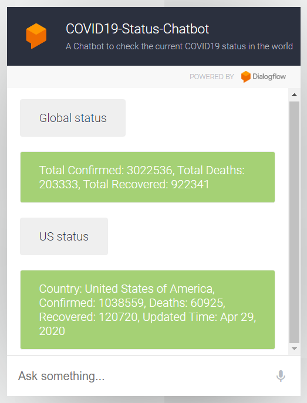

# COVID19 Status Webhook

## Introduction

This is the Webhook service to feed the Dialogflow COVID19 Status Chatbot.
Given an input country, it returns the COVID-19 status of that country by making a request to the 
[COVID19 API](https://documenter.getpostman.com/view/10808728/SzS8rjbc?version=latest) provided by Postman.

## Deployment

The service is deployed using Heroku at [https://safe-bastion-98853.herokuapp.com/](https://safe-bastion-98853.herokuapp.com/)

## Host the service locally

```
$ npm install
$ npm start
```

## Make a POST request

You may make a POST request to the URL: `https://safe-bastion-98853.herokuapp.com/webhook` or `localhost:3000/webhook` (if hosted locally) using Postman.

Sample request body:
```
{
    "queryResult": {
        "parameters": {
            "country": "singapore"
        }
    }
}
```

Sample response:
```
{
    "fulfillment_text": "",
    "fulfillmentMessages": [
        {
            "text": {
                "text": [
                    "Country: Singapore, Confirmed: 14423, Deaths: 14, Recovered: 1095, Updated Time: Apr 27, 2020"
                ]
            }
        }
    ],
    "source": ""
}
```

## Chatbot Demo

You can visit the web demo at [https://bot.dialogflow.com/covid19-status-chatbot](https://bot.dialogflow.com/covid19-status-chatbot).

Otherwise, you can have a try with the COVID19 Status Chatbot on Telegram at [t.me/COVID19_Status_Chatbot](t.me/COVID19_Status_Chatbot).

For demo purposes, it only supports world status and 4 countries (Singapore, Vietnam, United States, and Australia) - my favorites.

<p align="center">
  
</p>
